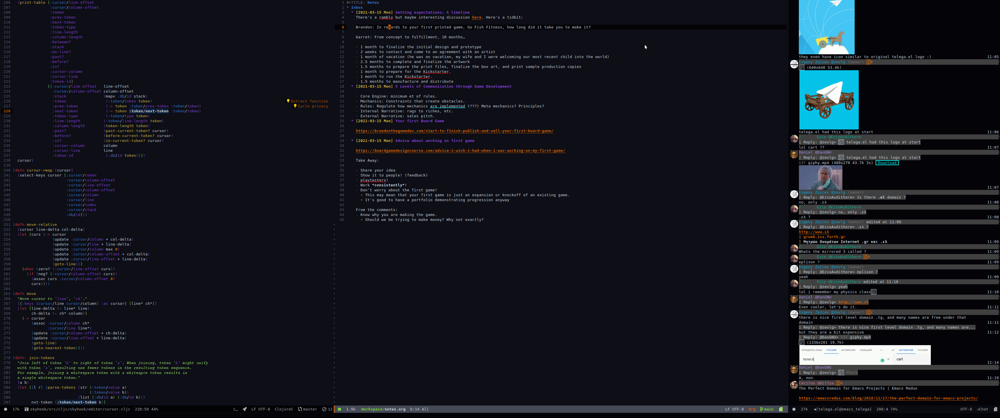

# Table of Contents

1.  [Installing](#orgcc7d461)
    1.  [Windows](#org8ea87bf)
        1.  [Linux](#org20d7c63)
2.  [Development](#org5618f30)
    1.  [Colaborative editing](#org0ba56ff)
    2.  [Communication](#orgc0c1de3)
    3.  [Essential Commands](#org14b321c)

This is the docker environment for Gamedev.
It includes other Repos as [Git Submodules](https://git-scm.com/book/en/v2/Git-Tools-Submodules). These include:

-   `modules/doom.d`: The doom emacs config directory.
-   `moduues/emacs.d`: The doom emacs install directory.
-   `modules/skyhook`: Working repo for the EuroZone project.

The environment includes Python, Clojure, Java, Node.js, and Clojurescript.

# Installing

## Windows

-   [Install](https://www.windowscentral.com/how-install-wsl2-windows-10) WSL 2.
-   [Install Ubuntu](https://linoxide.com/how-install-ubuntu-windows-10/#:~:text=%20Install%20Ubuntu%20on%20Windows%2010%20WSL%202,Linux%20kernel%20update%20package%20and%20double...%20More) with WSL 2.
-   Install [Docker Desktop](https://www.docker.com/products/docker-desktop) for Windows.
-   Enable WSL 2 engine in docker: go to settings and toggle &ldquo;Use the WSL 2 based engine&rdquo;.
-   Restart docker.
-   Install [vcxsrv](https://sourceforge.net/projects/vcxsrv/) using windows.
-   Create a shortcut to launch cvxsrv on your desktop:
    -   Right Click -> new -> shortcut.
    -   past this in the &ldquo;location&rdquo; field: `"C:\Program Files\VcXsrv\vcxsrv.exe" :0 -ac -terminate -lesspointer -multiwindow -clipboard -wgl -ac -dpi auto`
    -   Save shortcut
-   Launch CvSxrv by double clicking the X icon. You should see it show up in your running programs panel.
-   Login into ubuntu.
-   Install terminator: `sudo apt install terminator`
-   Launch terminator by just invoking the command at the prompt. You should see a new terminal window show up. If you get this far,
    it means your X window server is working.
-   Install some programs:
    -   zsh & git: `sudo apt install zsh git`
    -   oh-my-zsh: `sh -c "$(curl -fsSL https://raw.github.com/ohmyzsh/ohmyzsh/master/tools/install.sh)"`
-   Launch into zsh terminal.
-   Configure git: `git config --global user.email "<your email here>" && git config --global user.name "<your name here>"`
-   Create an ssh-key:
    -   `ssh-keygen -C "<email>"` (default all the options)
    -   Cat the public key: `cat ~/.ssh/id_rsa.pub`
    -   Copy/Paste your public key into github. See [here](https://github.com/settings/keys), click &ldquo;New SSH key&rdquo;.
-   Create ssh session: ``eval `ssh-agent` && ssh-add ~/.ssh/id_rsa``
-   Clone the repo: `git clone git@github.com:cartesian-theatrics/games.git --recursive`
-   Build docker container: `./docker_build.sh` (this will take a long time the first time)
-   Run docker container: `./docker_run_windows.sh` (this will also take a long time the first time)

### Linux

Once you have docker installed, Simply run:

1.  ./dockerbuild.sh (in this directory)
2.  ./dockerrun.sh (in this directory)

# Development

## Colaborative editing

We&rsquo;ll use crdt.el for collaborative editing. It&rsquo;s designed for
org-mode and allows you to share any emacs buffer for collaborative
editing. See the README [here](https://code.librehq.com/qhong/crdt.el). The docker container is already
setup with \`tuntox\`, so follow the guide for that to share your buffers.

I&rsquo;ll make sure that CRDT is supported out-of-the-box as I setup the emacs
environment here. I&rsquo;ve tested it already with two computers and it works
wonderfully.

## Communication

I installed telegram into the container with voice support so we should be able to
chat to each other directly in emacs. You&rsquo;ll want to install telegram for your
desktop: <https://desktop.telegram.org/>

Just run `M-x telega` (say yes to the compile questions) to connect the emacs
client to your telegram desktop.

## Essential Commands

<table border="2" cellspacing="0" cellpadding="6" rules="groups" frame="hsides">

<colgroup>
<col  class="org-left" />

<col  class="org-left" />

<col  class="org-left" />

<col  class="org-left" />

<col  class="org-left" />
</colgroup>
<thead>
<tr>
<th scope="col" class="org-left">Category</th>
<th scope="col" class="org-left">Hint</th>
<th scope="col" class="org-left">key pattern</th>
<th scope="col" class="org-left">command</th>
<th scope="col" class="org-left">Note</th>
</tr>
</thead>

<tbody>
<tr>
<td class="org-left">Emacs</td>
<td class="org-left">Emacs is stuck</td>
<td class="org-left"><code>Ctrl-g</code></td>
<td class="org-left">&#xa0;</td>
<td class="org-left">&#xa0;</td>
</tr>

<tr>
<td class="org-left">Navigation</td>
<td class="org-left">Enter Normal</td>
<td class="org-left"><code>ESC</code></td>
<td class="org-left">evil-normal-state</td>
<td class="org-left">it&rsquo;s recommended to remap CAPS to ESC</td>
</tr>

<tr>
<td class="org-left">Navigation</td>
<td class="org-left">Enter Insert</td>
<td class="org-left"><code>i</code></td>
<td class="org-left">evil-insert</td>
<td class="org-left">&#xa0;</td>
</tr>

<tr>
<td class="org-left">Navigation</td>
<td class="org-left">Enter Visual</td>
<td class="org-left"><code>v</code></td>
<td class="org-left">evil-visual-state</td>
<td class="org-left">Used for selecting text</td>
</tr>

<tr>
<td class="org-left">Doom</td>
<td class="org-left">Get Help</td>
<td class="org-left"><code>SPC h d h</code></td>
<td class="org-left">doom/help</td>
<td class="org-left">Learn Doom</td>
</tr>

<tr>
<td class="org-left">Buffers</td>
<td class="org-left">Goto Buffer</td>
<td class="org-left"><code>SPC b b</code></td>
<td class="org-left">switch-workspace-buffer</td>
<td class="org-left">&#xa0;</td>
</tr>

<tr>
<td class="org-left">Buffers</td>
<td class="org-left">Goto Any Buffer</td>
<td class="org-left"><code>SPC b B</code></td>
<td class="org-left">switch-buffer</td>
<td class="org-left">Inclues Process Buffers</td>
</tr>

<tr>
<td class="org-left">Buffers</td>
<td class="org-left">Manage Buffers</td>
<td class="org-left"><code>SPC b i</code></td>
<td class="org-left">ibuffer</td>
<td class="org-left">Press <code>d</code> to mark, <code>d</code> to delete</td>
</tr>

<tr>
<td class="org-left">Terminal</td>
<td class="org-left">Open term</td>
<td class="org-left"><code>M-x vterm</code></td>
<td class="org-left">vterm</td>
<td class="org-left">Open <a href="https://ohmyz.sh/">oh-my-zsh</a> shell</td>
</tr>

<tr>
<td class="org-left">Search</td>
<td class="org-left">Recent files</td>
<td class="org-left"><code>SPC f r</code></td>
<td class="org-left">recentf-open-files</td>
<td class="org-left">Find recent files.</td>
</tr>

<tr>
<td class="org-left">Search</td>
<td class="org-left">Project files</td>
<td class="org-left"><code>SPC p f</code></td>
<td class="org-left">projectile-find-file</td>
<td class="org-left">Find file in project (git repo)</td>
</tr>

<tr>
<td class="org-left">Search</td>
<td class="org-left">Omni Search</td>
<td class="org-left"><code>SPC *</code></td>
<td class="org-left">&#xa0;</td>
<td class="org-left">Omni search files in project</td>
</tr>

<tr>
<td class="org-left">Search</td>
<td class="org-left">Command Search</td>
<td class="org-left"><code>SPC :</code></td>
<td class="org-left">execute-extended-command</td>
<td class="org-left">Search for a emacs command</td>
</tr>

<tr>
<td class="org-left">Chat</td>
<td class="org-left">Open Telegram client</td>
<td class="org-left"><code>M-x telega</code></td>
<td class="org-left">&#xa0;</td>
<td class="org-left">Open <a href="https://zevlg.github.io/telega.el/">telegram chat client</a></td>
</tr>

<tr>
<td class="org-left">Version Control</td>
<td class="org-left">Manage Git</td>
<td class="org-left"><code>SPC g g</code></td>
<td class="org-left">magit-status</td>
<td class="org-left">The ultimate git interface</td>
</tr>

<tr>
<td class="org-left">Version Control</td>
<td class="org-left">Get help</td>
<td class="org-left"><code>h</code></td>
<td class="org-left">magit-popup-help</td>
<td class="org-left">Run in <code>magit-satus</code> context</td>
</tr>
</tbody>
</table>

